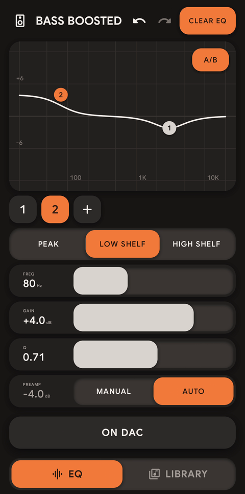
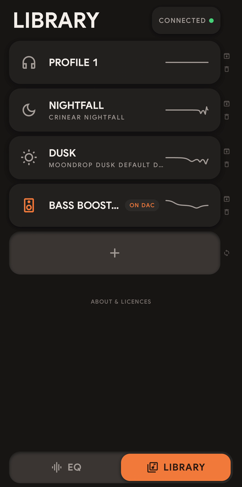

<p align="center"></p>

# Contour

**An on-the-go EQ manager for the CrinEar Protocol Micro and Protocol Max.** Keep all your EQ profiles on your phone, plug the
dongle in, pick one and send it. Plug in, send, unplug - that is the whole routine.

**Website: [chronosauros.github.io/contour](https://chronosauros.github.io/contour/)** - a 1.5-minute demo film, the full guide film and the install page.

<p align="center">
  
  &nbsp;&nbsp;
  
</p>

## Why it exists

The Protocol Micro and Protocol Max have a parametric EQ built into the dongle itself. Whatever EQ a dongle holds works with every
app and every device you plug it into - no system equaliser, no app running in the background. But
the official way to change it is CrinEar's browser tool at [eq.hangout.audio](https://eq.hangout.audio/),
which the maker lists for desktop (PC and macOS) browsers. There is no official mobile app, and phone
browsers lack the WebHID support the tool relies on - so in practice you need a computer nearby.

Contour puts that on your phone. It is deliberately a small, simple tool:

- **Your EQs are saved.** One profile per pair of earphones, or per mood. They live on the phone, ready
  whenever the dongle is plugged in.
- **Sending takes seconds.** Plug the dongle in, tap a profile, hold HOLD TO SEND. Contour writes it, reads
  it back to check every value, and stores it in the dongle's memory.
- **Then the phone is out of the picture.** Unplug the dongle and use it with your laptop, another phone or
  anything else. The EQ stays in it until you send another one.
- **Real examples to start from.** The first launch includes NIGHTFALL, the maintainer's own tuning for
  the CrinEar Nightfall, and DUSK, the default curve of Moondrop's DSP cable for the Moondrop x Crinacle
  DUSK (so the analog cable sounds like the DSP one), next to a flat PROFILE 1.
- **You can still tune on the go.** Drag bands on the graph, fine-tune with sliders, paste an AutoEQ
  profile from the clipboard, or read the current EQ off the dongle.

Contour does not process audio, does not need the internet and has no accounts. It only talks to the dongle.

**Watch the [guide](https://chronosauros.github.io/contour/guide/)**: every function of the app in a 6-minute film, with chapters and the full text.

## Supported hardware

- **CrinEar Protocol Micro** (USB `3302:C20F`, WalkPlay chip): 8 bands, PEAK, LOW SHELF and HIGH SHELF,
  gain -10 to +10 dB, Q 0.1 to 10, 20 Hz to 20 kHz, preamp -30 to 0 dB in whole dB. Tested on the developer's own hardware.
- **CrinEar Protocol Max** (USB `3302:43CC`, WalkPlay chip): 10 bands, PEAK, LOW SHELF and HIGH SHELF as native filters,
  gain -10 to +10 dB, Q 0.1 to 10, 20 Hz to 20 kHz, preamp -30 to 0 dB in whole dB, computed and sent by the app.
  Tested by a Reddit community member on a real Protocol Max (8 bands, peak and shelf filters, no crashes).

Contour is unofficial and not affiliated with CrinEar. Other WalkPlay and FiiO dongles are possible later
(see `ROADMAP.md`); they are not enabled until someone confirms one on real hardware.

Needs Android 9 or newer and a phone with USB host (USB OTG) support.

## At a glance

Two pages, switched with the bar at the bottom or by swiping: **EQ** and **LIBRARY**.

- **EQ** edits the current profile: drag, tap, double-tap and pinch band nodes on the graph; PEAK, LOW
  SHELF and HIGH SHELF filters; FREQ, GAIN and Q sliders that are fine when you drag slowly and cover the
  whole range when you drag fast; tap any number to type it; PREAMP with a MANUAL / AUTO anti-clipping bar; A/B to hear the curve off and on at the same volume (the preamp stays; Protocol Micro only for now).
- **HOLD TO SEND** (0.7 s hold) writes the profile to the dongle, reads it back, compares every register and
  only then saves it to the dongle's memory. The button then shows ON DAC.
- **Undo and redo** work like Ctrl+Z: one touch is one step, up to 100 steps per profile, kept after closing
  the app. **CLEAR EQ** leaves one flat band and is an undo step too. **LAST SENT** appears when the profile
  differs from what the dongle holds, and goes back to that version.
- **LIBRARY** keeps your profiles: tap to open, long-press to rename, change the icon, duplicate or share;
  swipe to archive or delete, with UNDO. New profiles start flat, come from the clipboard (Equalizer APO /
  AutoEQ parametric text or EQ by Ear JSON) or are read from the dongle.

On the Protocol Micro only, HIGH SHELF bands are sent as a mirrored LOW SHELF plus preamp, which gives exactly the
same curve shape (the Protocol Max has native shelf filters and needs no mirroring) (the maths is in `android/core/src/main/kotlin/io/github/chronosauros/contour/core/Device.kt`).

## Safety

Contour writes to the DAC only when you hold HOLD TO SEND (or confirm an action on the service screen). It
sends only commands documented in `research/protocol/PROTOCOL.md`, checked on a real device, and verifies
every write by reading it back. Still, this is an unofficial tool talking to hardware: use it at your own
risk (see the warranty disclaimer in `LICENSE`).

## Install

**Step-by-step instructions: [chronosauros.github.io/contour/install](https://chronosauros.github.io/contour/install/)**

- **[Obtainium](https://obtainium.imranr.dev/)** (recommended, updates itself): in Obtainium tap Add app and
  paste `https://github.com/Chronosauros/contour`, or on your phone tap
  [Add Contour to Obtainium](https://chronosauros.github.io/contour/install/#obtainium).
- **APK**: download `contour-<version>.apk` from the [latest release](../../releases/latest) and open it on
  your phone (Android asks you to allow installs from that source).

Every official build is signed by the same key: package `io.github.chronosauros.contour`, certificate
SHA-256 `C8:C8:CA:EA:76:16:28:ED:9D:50:5F:F0:73:42:EE:5E:A0:D4:66:A4:AD:71:8D:0D:B0:77:42:2B:A3:F7:E6:01`
(CN=Chronosaur). Each release also lists the APK's SHA-256. The [guide](https://chronosauros.github.io/contour/guide/)
takes it from there.

## Build

Requirements: JDK 21 and the Android SDK (platform 37.2, build-tools 36 or newer).

```
cd android
./gradlew :core:test            # protocol and codec parity test
./gradlew :app:assembleRelease  # unsigned release APK in app/build/outputs/apk/release/
./gradlew :app:assemblePerf     # review build (package ...contour.perf, debug-signed, profileable)
```

`android/wsl-build.sh` wraps the same tasks for Linux / WSL with the paths from `android/toolchain.env`
(copy `toolchain.env.example`). The release APK is unsigned unless you pass your own key, see
`android/app/build.gradle.kts`.

Code layout:
- `android/core` - pure Kotlin/JVM: profile model, DSP, text codecs, the WalkPlay device protocol;
- `android/app` - the Jetpack Compose app, USB HID transport, storage;
- `research/protocol` - protocol notes, Python reference tools and the device captures the parity test
  checks against.

## Privacy

Contour has no internet permission, no analytics and no accounts. Profiles stay on the phone. See
`PRIVACY.md`.

## Contributing

Issues and pull requests are welcome, especially reports from other WalkPlay-based DACs. Read
`CONTRIBUTING.md` first.

## Licence and credits

Contour is licensed under the Apache License, Version 2.0 (`LICENSE`).

The WalkPlay protocol and the biquad coefficient maths are ported from
[devicePEQ](https://github.com/jeromeof/devicePEQ) by Jerome O'Flaherty (0BSD). Every third-party
component and its licence is listed in `THIRD_PARTY_NOTICES.md`; attributions are in `NOTICE`. The DUSK
example profile uses the DUSK-Default DSP curve
[published by Crinacle](https://crinacle.com/2024/04/10/moondrop-x-crinacle-dusk-eq-dsp-values/). In the app,
all of this is under **ABOUT & LICENCES** at the bottom of the Library.

Contour is an unofficial project, not affiliated with or endorsed by CrinEar or any other brand. CrinEar,
Protocol Micro, Protocol Max, Nightfall, WalkPlay, Moondrop, Crinacle, DUSK and other product names belong to their owners
and are used only to say what Contour works with.
