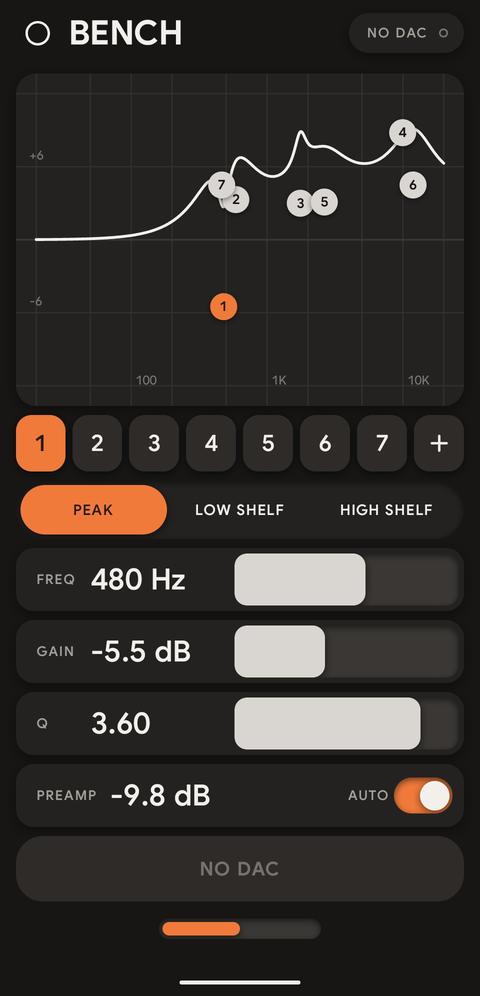
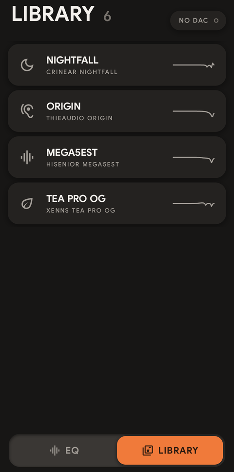
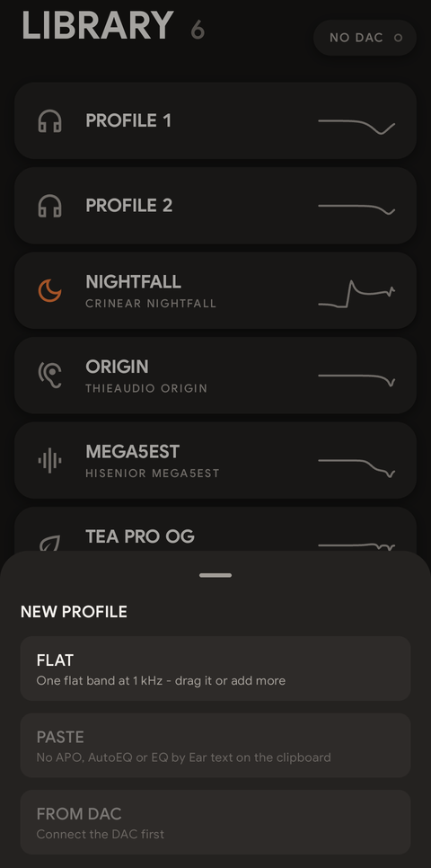

# Contour user guide

Contour keeps your EQ profiles on your phone and writes the one you pick into a CrinEar Protocol Micro.
The idea is simple: plug the dongle in, choose a profile, hold the button, unplug. The EQ now lives
inside the dongle, so it works with every app and every device you plug the dongle into afterwards,
until you send a different one.

This guide walks through everything the app does. If you only want the short version, read
[The everyday routine](#the-everyday-routine) and stop there.

## Contents

- [What you need](#what-you-need)
- [Install](#install)
- [The everyday routine](#the-everyday-routine)
- [The two pages](#the-two-pages)
- [Status and connecting](#status-and-connecting)
- [EQ page: editing a profile](#eq-page-editing-a-profile)
- [Sending to the DAC](#sending-to-the-dac)
- [Library page: your profiles](#library-page-your-profiles)
- [Making new profiles](#making-new-profiles)
- [Sharing and backing up](#sharing-and-backing-up)
- [Service screen](#service-screen)
- [How the Protocol Micro limits work](#how-the-protocol-micro-limits-work)
- [Troubleshooting](#troubleshooting)

## What you need

- A **CrinEar Protocol Micro** USB DAC.
- An Android phone with **Android 9 or newer** and USB host (USB OTG) support. Almost every phone with
  a USB-C port has it.
- Nothing else: no account, no internet connection, no other app.

## Install

1. Download the newest `contour-<version>.apk` from the [Releases page](https://github.com/Chronosauros/contour/releases).
2. Open the file on your phone. Android asks you to allow installs from your browser or file manager
   the first time; allow it for that app.
3. Open Contour. The first time it starts with three profiles: **PROFILE 1**, holding a single flat
   band to play with, **NIGHTFALL**, the maintainer's own tuning for the CrinEar Nightfall, and
   **DUSK**, the DUSK-Default curve of Moondrop's DSP cable (as published by Crinacle), so the
   Moondrop x Crinacle DUSK on its analog cable sounds like it does on the DSP cable. Delete any of
   them whenever you like. Profiles you already have are never touched by an update, so the examples
   appear only on a fresh install.

If you want to make sure the file is genuine, compare its SHA-256 with the one listed on the release.

## The everyday routine

1. Plug the Protocol Micro into the phone. Android may offer to open Contour - say yes, and tick
   "always" if you want it to open by itself next time.
2. The status in the top right corner changes to **CONNECTED** with a green dot. If it says
   **TAP TO CONNECT**, tap it once and allow USB access.
3. Go to **LIBRARY** and tap the profile you want. It opens on the EQ page.
4. **Hold** the big orange **HOLD TO SEND** button until it fills up (under a second).
5. The button turns into **ON DAC**. Done - unplug the dongle and use it anywhere.

That is the whole point of the app: your EQs are saved on the phone, and moving one into the dongle
takes a few seconds.

## The two pages

Contour has two pages: **EQ**, where you shape the current profile, and **LIBRARY**, where you keep all
of them. Switch between them with the bar at the bottom of the screen, or swipe left and right.

  
  &nbsp;&nbsp;
  

## Status and connecting

The pill in the top right corner of both pages tells you what the DAC is doing:

| Status | Meaning |
|---|---|
| **NO DAC** | No Protocol Micro is plugged in. |
| **TAP TO CONNECT** | The DAC is there, but Android has not given Contour access yet. Tap it and allow. |
| **CONNECTED** (green dot) | Ready to send. |
| **BUSY** | Contour is talking to the DAC right now. Wait a moment. |

Contour only ever looks for the Protocol Micro. Other USB devices are ignored.

## EQ page: editing a profile

The top of the page shows the profile's icon and name. Below it are the response graph, the band
chips, the filter type and the sliders.

### The response graph

The white line is what your EQ does to the sound, from 20 Hz on the left to 20 kHz on the right. Each
numbered dot is one band.

- **Drag a dot** to move a band: left and right changes its frequency, up and down its gain.
- **Tap a dot** to select it.
- **Double-tap a dot** to set its gain back to 0 dB.
- **Pinch** with two fingers to make the selected band narrower or wider (its Q).
- **Long-press an empty spot** to add a new band right there.

### Band chips

The numbered chips under the graph are the same bands.

- **Tap** a chip to select that band.
- **Long-press** a chip for **BYPASS** (switch the band off without deleting it, and back on with
  **ENABLE**) or **DELETE**.
- **+** adds a band. The Protocol Micro holds up to 8.

A new band starts flat: PEAK, 0 dB, Q 0.71.

### Filter type

- **PEAK** raises or lowers a range around the frequency.
- **LOW SHELF** raises or lowers everything below the frequency.
- **HIGH SHELF** raises or lowers everything above the frequency.

### FREQ, GAIN and Q sliders

The sliders work relative to where they are, so touching one never makes the value jump.

- **Slow drags** move the value in fine steps, for small corrections.
- **Fast drags** cover the whole range quickly - one fast swipe on FREQ goes all the way from 20 Hz to
  20 kHz.
- **Tap the number** to type an exact value.

Ranges: FREQ 20 Hz to 20 kHz, GAIN -10 to +10 dB, Q 0.1 to 10.

### PREAMP

Boosting bands can make the signal clip. The preamp lowers the whole volume to make room.

- With **AUTO** on (the default), Contour works out the lowest preamp that keeps the curve from
  clipping and updates it as you edit.
- With **AUTO** off, drag the dB value sideways, or tap it to type a value. The Protocol Micro takes
  whole dB from -30 to 0.

Everything you change is saved on the phone immediately. There is no save button and nothing to lose
if you close the app.

## Sending to the DAC

**HOLD TO SEND** is the only button that writes to the dongle. Hold it for about 0.7 seconds: it fills
from left to right with a growing vibration, and clicks when full. A tap alone does nothing, so you
cannot send by accident.

What happens next:

1. Contour writes every band and the preamp to the DAC.
2. It reads everything back and compares it with what it sent.
3. Only if all of it matches does it tell the DAC to keep the EQ in its memory.

The button then shows what happened:

| Button | Meaning |
|---|---|
| **HOLD TO SEND** | Ready. The current profile is not on the DAC yet, or you changed it since. |
| **SENDING** | Writing and checking. Keep the DAC plugged in. |
| **ON DAC** | This exact profile is on the DAC and saved in its memory. |
| **FAILED - HOLD TO RETRY** | Something did not match or the DAC was unplugged. Hold again. |
| **NO DAC** / **TAP TO CONNECT** | Plug the DAC in, or tap to allow access. |

The Library marks the profile last sent with **ON DAC**, so you always know what the dongle holds.

## Library page: your profiles

Every profile is a card with its icon, name, a short description and a small picture of its curve.
The number next to LIBRARY is how many profiles you have.

- **Tap** a card to make it the current profile and open it on the EQ page.
- **Long-press** a card to edit it: change the **NAME** and description, pick an **ICON**,
  **DUPLICATE** it (handy before experimenting) or **SHARE** it.
- **Swipe left** on a card to **ARCHIVE** or **DELETE** it. Both show **UNDO** for 5 seconds.
  Archived profiles move to a folded section at the bottom of the list. Open it and swipe an archived
  card to **RESTORE** it.

A good habit: one profile per pair of earphones or headphones, named after them.

## Making new profiles

Tap the empty card with **+** at the end of the Library.

- **FLAT** - one flat band at 1 kHz. Drag it or add more.
- **PASTE** - takes an EQ from the clipboard. Copy a parametric EQ first, for example from
  [AutoEQ](https://autoeq.app) (the "Equalizer APO" / parametric text), a Squiglink graph tool, or an
  EQ by Ear JSON export, then tap PASTE. If the clipboard holds nothing Contour understands, the option
  is greyed out.
- **FROM DAC** - reads the EQ that is on the dongle right now and saves it as a profile. Useful the
  first time, to keep whatever was on it before.

Pasted EQs with more than 8 bands, or values outside the Protocol Micro's ranges, are trimmed to fit;
the PASTE line tells you when that happened. Check the curve before sending.

## Sharing and backing up

**SHARE** (long-press a profile) sends it as plain text in the Equalizer APO parametric format - the same
format PASTE reads. Send it to yourself in a messaging app or notes app, and you have a backup you can
paste back into Contour on any phone, or load into Equalizer APO and other EQ tools on a computer.

Profiles live only on your phone. Uninstalling Contour deletes them, so share the ones you care about
first.

## About and licences

**ABOUT & LICENCES** at the very bottom of the Library shows the app version, the copyright, and the
open-source licences of Contour and everything it uses (also reachable from the service screen).

## Service screen

Long-press the status pill (top right) to open the service screen. You will rarely need it:

- the raw state the DAC reports, band by band;
- a log of the USB conversation, useful for bug reports;
- **Read from DAC**, and **Restore flat**, which writes a flat EQ to the DAC (asks for confirmation first);
- **Licences**: the open-source licences of Contour and everything it uses.

## How the Protocol Micro limits work

The dongle has 8 bands, the three filter types, gain from -10 to +10 dB, Q from 0.1 to 10, frequencies
from 20 Hz to 20 kHz, and a preamp in whole dB from -30 to 0. Contour never lets you set anything outside
those limits, so what you see is what the dongle plays.

One detail: the Protocol Micro has no real high-shelf filter. Contour sends a HIGH SHELF as a mirrored
LOW SHELF plus preamp, which gives exactly the same curve. You do not need to do anything about it; the
graph and the sound match.

## Troubleshooting

**The status stays on NO DAC.** Unplug and plug the dongle again. Try without adapters or hubs. Check
that USB OTG is on, if your phone has a setting for it.

**TAP TO CONNECT comes back every time.** Android asks for USB access per session. When Android offers to
open Contour after plugging in, tick "always" - then it opens straight away with access granted.

**FAILED - HOLD TO RETRY.** Usually the dongle was unplugged or moved during sending. Hold the button
again. If it keeps failing, open the service screen and share the USB log in a
[GitHub issue](https://github.com/Chronosauros/contour/issues).

**PASTE is greyed out.** The clipboard does not hold a parametric EQ Contour understands. Copy the text
again - the part with lines like `Filter 1: ON PK Fc 105 Hz Gain 3.0 dB Q 0.71`.

**The sound is quieter after sending.** That is the preamp making room for boosted bands. It keeps the
sound clean. Turn the volume up a little, or reduce the boosts.

**Does the EQ stay on the dongle?** Yes. After ON DAC it is stored in the dongle's memory and stays there
when you unplug it, until you send something else.

---

Contour is unofficial and not affiliated with CrinEar. It writes to hardware, so use it at your own risk
(see `LICENSE`).
